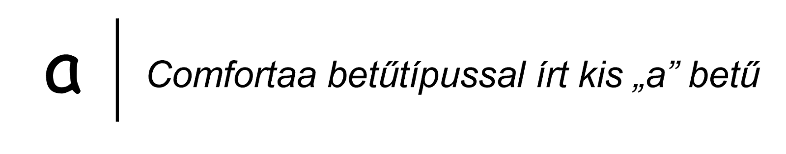
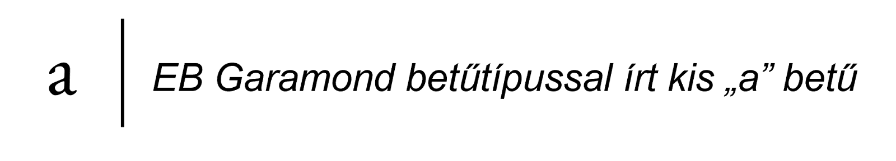
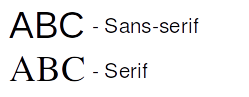

.. _absztrakcios szintek:

====================
Absztrakciós szintek
====================

A számítógépes szövegek kezelésének rendszerébe való betekintéshez ismerni kell azok elektronikus reprezentációit, a reprezentációk történelmi előzményeit, működését és az azt övező legfőbb problémákat. Fontos meghatározni, hogy mi számít egy karakternek a számítástechnikában, és mi a különbség egy karakter „beviteli”, „logikai” és „megjelenített” formája közt.

A szövegek formázásáról a **Markdown/LaTeX** fejezetben lesz szó. A szövegfájlok fájlrendszerben való tárolását és metaadatolását a **Linux** fejezetben, míg  a szövegek gépek közötti átvitelét és a programok forrásfájljainak, programozás közbeni használatának részleteit a **Python** fejezetben tárgyaljuk részletesebben.

Túlhaladott és tisztán technikai problémának tűnhet, de a karakterkódolások, amikkel napjainkban találkozhatunk, folyamatos fejlődésben, átalakulásban vannak. Ha elég régen archivált vagy megfelelően régi digitális szövegekkel, illetve különböző időben fejlesztett programokkal dolgozunk, akkor számos anomáliával találjuk szemben magunkat, amelyek feloldásához érteni kell a karakterkódolások működését akár visszamenőleg is. A karakterkódolás így a digitális szövegek alapköveként határozza meg minden digitalizált szövegfeldolgozással foglalkozó tudomány (nyelvészet, történettudomány stb.) összes forrásanyagát, ennélfogva bárkinek, aki a digitális bölcsészettel akar foglalkozni, ismernie kell annak alapjait.

.. _billentyukodok:

--------------
Billentyűkódok
--------------

Az elsődleges beviteli periféria a számítógépen a billentyűzet. Eredetileg az amerikai angol nyelvre lett kifejlesztve, és az írógépek kiosztásának hagyományát követi (lásd :ref:`bevitel gyorsitasa` rész). A billentyűk leütésekor **billentyűkódok** keletkeznek (akár több is egyszerre, ami lehetővé teszi a billentyűk kombinálását, pl. *shift* billentyű + betű gombok → nagybetűk), melyek a billentyűzet kiosztásától függően karakterekké alakítódnak át. Ez lehetővé teszi, hogy egy adott fizikai billentyűzet „nyelve” dinamikusan állítható legyen, azaz a leütött billentyűk más karaktereket eredményezzenek, vagy akár `zongorabillentyűként is lehessen használni az egyes billentyűket hangok kódolására <https://www.onlinepianist.com/virtual-piano>`_.

A legelterjedtebb `billentyűzetkiosztás <https://en.wikipedia.org/wiki/Keyboard_layout>`_ az **ANSI (ANSI-INCITS 154-1988)** másnéven **QUERTY** vagy **US English**. Fő ismérve, hogy az ``z`` és ``y`` betűk fordítva vannak a magyar kiosztáshoz képest (ami *QUERTZ* néven is ismert), Ezen kívül fontos különbségek a következők:

- **Nem tartalmaz dedikált fizikai billentyűt a magyar hosszú i (** ``í`` **) betűnek**, de a billentyű kódja előállítható a `„jobb oldali” <https://hu.wikipedia.org/wiki/AltGr>`_ ``Alt`` (``Alt Gr``) `billentyű <https://hu.wikipedia.org/wiki/AltGr>`_ és ``j`` billentyű együttes lenyomásával. Nyomtatott nagy változatban (``Í``) pedig a ``j`` helyet az ``i`` billentyűt nyomva (``Alt Gr`` + ``i``) „írható be”.
- A magyar billentyűzeten a fölül egy sorban elhelyezkedő a számok a balról az első billentyűvel kezdődnek ``0``-val és a ``9`` az utolsó, mielőtt a ``ö`` billentyű jön. Ezzel szemben a QUERTY változatban a második billentyűvel ``1``-el kezdődik a számozás és a ``9`` után a magyar ``ő`` helyén van a ``0``.
- A nem alfanumerikus (betű és szám) karakterek beírásához más billentyűkombinációkat kell lenyomni, mint megszokhattunk.

Míg a ``0`` billentyű helye, az ``x``-``y`` betűpár és a többi nem alfanumerikus karakter kódja szoftveresen átdefiniálható a magasabb szintű műveleteknél (pl. Bluetooth párosításnál az ANSI változat ``0``-ját kell beírni szinte mindig függetlenül a feliratoktól.), a fizikai hosszú ``í`` billentyű hiánya nem pótolható utólag. Bár át lehet matricázni vagy fizikailag ki lehet cserélni az egyes billentyűk feliratait akár gyárilag is (ezeket a valójában ANSI billentyűzeteket nevezik néha **QUERTZ billentyűzeteknek**), csak az **ISO kiosztású (ISO/IEC 9995-2)** többnyire **nemzetközi ISO (ISO international)** billentyűzetek fogják tartalmazni a szükséges billentyűket a teljes magyar kiosztáshoz a dedikált fizikai hosszú i billentyűvel. Manapság létezik még a Japán típusú, **JIS (JIS X 6002-1980)** billentyűzet is, mely az ázsiai nyelvekre összpontosít. `Napjainkban ezek a fizikai kialakítások <https://blog.ansi.org/standardization-of-keyboard-layouts/>`_ vannak egy adott nyelvnek megfelelően felcímkézve.

.. _karakterek es nyelvek:

---------------------------------------------------
Karakterek és nyelvek (lokalizáció absztrakt módon)
---------------------------------------------------

Egy szöveg legkisebb szemantikus jelentést tartalmazó, absztrakt logikai egységei a **karakterek**, melyek egy számítógépen keletkezhetnek például a fent említett billentyűkódokból. Ennek az absztrakciós szintnek a célja a bevitel és a megjelenítés közötti kapcsolat megteremtése, mivel ez a kapcsolat nyelvenként és használati esetenként eltérő lehet. Egy karakter lehet betű, szám, írásjel vagy szóköz. Az angol ábécé 26 betűjét 26 karakterrel reprezentáljuk, viszont ezek csak a kisbetűk, így igazából az angol ábécéhez összesen 52 karaktert tudunk társítani, mivel a kis a (``a``) és a nagy a (``A``) két különböző karakternek számít. A magyar ábécé az angol ábécé betűin felül tartalmaz ékezetes betűket (pl. á, í, ő, ű), melyek külön karakternek számítanak, valamint két és három karakterből álló többjegyű betűket (*digráfok*, és *trigráfok* pl. sz, cs, gy, ny, dzs) is, így összesen 35 karakterre van szükség a magyar ábécé 44 betűjének leírásához. A karakterek egymásutáni sorozatait **karakterláncoknak**, angolul **stringeknek** hívjuk.

A fentiekből látható, hogy az egyes karaktereknek vannak tulajdonságaik – ahogy absztrakt szinten a betűknek is –, melyeket össze kell egyeztetni az intuíciónkkal (lásd :ref:`tulajdonsagok` rész). Ebből a megközelítésből pedig további problémák származnak: binárisak legyenek-e a tulajdonságok, vagy pontosan milyen értékekkel rendelkezhetnek? Például a karakterek között vannak „kisbetűk” és „nagybetűk”, ami adná magát mint bináris tulajdonság (lásd :ref:`kis- es nagybetusites` rész), de nem minden karaktert tudunk besorolni ebbe a két osztályba (pl. arab számok és írásjelek). Továbbá vannak „látható” és „nem látható” karakterek (pl. *fehér szóközök (white space)*), melyek már sokkal egyértelműbben választhatók szét. Bizonyos munkafolyamatok megkövetelhetik az átjárhatóságot az egyes tulajdonságokkal rendelkező karakterosztályok között az intuitív működéshez (pl. kis-nagybetűk egyenlősége a kis- és nagybetűre érzéketlen keresés esetén).

Alapvető elvárásnak tűnik tehát, hogy minden karaktert meg lehessen különböztetni a többitől egy egyértelmű „kóddal”, és a tulajdonságaik mentén meg tudjuk teremteni köztük a szükség szerinti átjárást. Ez az írott szövegben a betűk formájával érhető el, de a számítógép esetében teljesen más gondolkodásra van szükség, mivel a „betűk formája” független a tárolt karakterektől.

.. _glifak:

------
Glifák
------

Egy karakter megjelenített formáját, vagyis a karakterek „ábráját”, melyet a papíron vagy a számítógépen látunk, hivatalos nevén **glifának** nevezzük. A glifák különféle **betűkészletekben** vannak csoportosítva (betűtípusok/fontok), így egy karakterhez rengeteg glifa tud társulni. Például a kis a betű (``a``) karakterét tudjuk így –

– és így is –

– ábrázolni.

.. _betutipusok:

-----------
Betűtípusok
-----------

A betűtípusok formátumuk szempontjából lehetnek hagyományos **bittérképes (bitmap)** és modern **vektoros (TrueType)** típusúak. A bittérképes betűkészletben minden mérethez külön „képet” kell tárolni a megfelelő méretű betűk előállításához. Az egyes képek képpontjainak színeihez tartozó fix bithosszúságú értékek sorban egymás után egy úgynevezett „bittérképen” kerülnek tárolásra (lásd még `BMP formátum <https://en.wikipedia.org/wiki/BMP_file_format>`_). Ezzel szemben a vektoros betűtípusok esetén csak a megjelenítéshez felhasznált geometriai alakzatok paraméterei tárolódnak, a különböző betűméretek pedig dinamikusan generálhatóak. A kettő közti különbség praktikusan abban nyilvánul meg, hogy az utóbbi tetszőleges méretre nagyítható úgy, hogy nem veszít élességéből, míg az előbbi kockásodik vagy homályos lesz a nagyítás során, ha az adott méret nincs benne a betűkészletben.

A betűk formáját tekintve az egyes betűtípusoknak lehet például *dőlt* és **félkövér** változata, ezek más-más glifával jelennek meg és szigorúan véve külön betűtípusnak számítanak. Egy másféle felosztás szerint a betűtípusok lehetnek **Sans-serif** és **Serif** típusúak. Az előbbibe tartoznak azok az ábrázolások, melyeknek nincs talpa (**talpatlan**), az utóbbiba pedig, melyeknek van (**talpas**).

Mivel az egyes betűkészletek különböző licencekkel rendelkeznek (pl. korlátozott terjeszthetőség, fizetős betűkészletek), bizonyos betűkészletek nem mindig elérhetőek a rendszerben (pl. a *Microsoft fontok* Linuxon). Előfordulhat az is, hogy a különböző nyelvekre kitalált betűkészletekben bizonyos karakterek (magyarban tipikusan a hosszú ő (``ő``) és hosszú ű (``ű``) nem mindig képezik a betűtípus részét. Mindkét esetben a **helyettesítési szabályoknak** megfelelően az előre telepített elérhető fontokból próbálja a rendszer megjeleníteni a kívánt módon a szöveget. Ezért fordulhat elő, hogy bizonyos betűk nem hasonlítanak a többire, illetve, hogy egy dokumentum más-más rendszerek alatt másképp jelenik meg (lásd :ref:`normalizacio es spam szures` rész).

   Az eredetileg használni kívánt Betűkészlet (*Segoe UI Bold*) nem tartalmazza az ``ő`` és ``ű`` betűket, így az **helyettesítve van** a *Times New Roman* betűkészlettel, amiben elérhetőek. (`Szabadon kipróbálható. <https://font.download/font/segoe-ui-4>`_)

Az ilyen helyettesítések másik következménye lehet, hogy nem ugyanannyi helyet foglal el a szöveg az egyik betűtípussal, mint a másikkal, ami a tördelésre is hatással lehet. Ez tipikusan a *Microsoft Word* dokumentumok *LibreOffice-ban* való megnyitásakor szembetűnő, amikor pár sor átcsúszik a következő lapra. Ennek oka, hogy a betűtípusoknak például mások a *szélességi arányai*, emellett az egyes betűk is eltérő szélességűek (pl. ``I`` és ``M``): ez a két tulajdonság önmagában is nagy mozgásteret ad a betűk megjelenítésének, és mellékhatásként felerősíti a különböző megjelenítőkön tapasztalható eltéréseket.

Számtalan esetben (pl. programozásnál, táblázatokban vagy régi, karakterorientált megjelenítőknél) kívánatos lehet a sorok „hálószerű” megjelenítése, melyben az ugyanannyi karakterből álló karaktersorok egyforma hosszúak, illetve a karakterek a különböző pozíciókban egymás alatt helyezkednek el. Ezeket a betűkészlettípusokat **fix szélességű betűkészleteknek** nevezzük, míg a szöveg folyamatos olvasásához jobban illeszkedő típusokat **változó szélességű betűkészleteknek** hívjuk.
