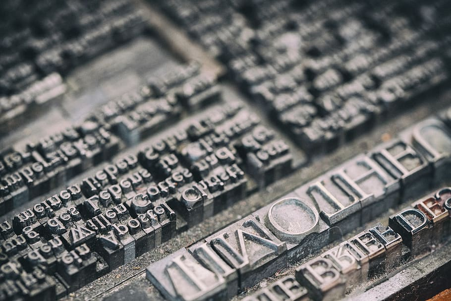

.. _karakterkodolas_tortenete:

===========================
A karakterkódolás története
===========================

Amikor „olvasóként” értelmezünk egy papírra írt jelet (**glifát**), akkor egy internalizált, közvetlen kapcsolatrendszerre hagyatkozunk, ami azt diktálja, hogy ez a jel egy glifa, ami logikailag egy ``a`` betű, amit úgy olvasunk, hogy ``„a”``. Ilyen közvetlen kapcsolatrendszer a számítógépen kezdetben nem létezett, ezért fel kellett építeni a meglévő hagyományokból, és a mai napig is a folyamatosan változó igényekhez kell igazítani.

Tulajdonképpen az az elvárás, hogy a fenti intuíciónknak megfelelő formába kerüljön a kimenet, bármi is történik a bevitel során. Minden karakter, melyet egy billentyű lenyomásával létrehozott *billentyűkóddal* beviszünk egy számítógép rendszerébe – a beállításoktól függően – kap egy *belső numerikus reprezentációt*, amelyet annak a karakternek szántak. Azt, hogy melyik numerikus reprezentáció (szám) melyik karaktert képviseli, és hogyan kell értelmezni a tárolt bitsorozatot, miközben a beviteltől eljut a megjelenésig, egy előre definiált *karakterkészlet* határozza meg, ami be van állítva a rendszerben. A használt karakterkészlet nagyban függ a bevitel módjától, valamint az átviteli médium és a fogadó sajátosságaitól. Ebben a fejezetben áttekintjük azokat a hatásokat, amelyek a mai rendszereket formálták.

.. _nyomtatas es olombetuk:

-------------------------
Nyomtatás és az ólombetűk
-------------------------

Az első elektronikus karakterkódolások megjelenésekor is már évszázados múltra visszatekintő könyvnyomtatás (1440, Illusztráció: `Family Guy (S11E7) - What can the obsession do! Gutenberg and the printing press <https://www.youtube.com/watch?v=cIwcRyaomzQ>`_), amely a glifák és a karakterek rendszerezésének kihívásait (**tipográfia**) már tudományként kezelte, nem foglalkozik a karakterkódolás absztrakt szintjeivel.

A nyomtatott szövegek az információ nyilvános terjesztését és megőrzését célozták, mivel a nyomtatás technológiája sokáig (lásd :ref:`bevitel gyorsitasa` rész) kevesek számára volt hozzáférhető. A nyomtatásban a kódoló és a befogadó is ember, csak a sokszorosítás van automatizálva. Alapvetően a szöveg betűnként, **ólomnyomatokból** van kirakva („betűz(del)ve” egymás mellé), de érdemes megfigyelni, hogy bizonyos *betűtípusoknál* az egyes betűk egymás után következése speciális szabályok alkalmazását igényli, ahogy a kézírásban vagy a beszédben is. Például az **ikerbetűknél (ligatúra)** speciális jeleket kell használni két karakter együttes előfordulásához (latin *„AE”*, német *„Eszett”, németül „scharfes S”* (``ß``) vagy a nem nyelvspecifikus *„fi”* kapcsolat, ahol az f áthúzása átnyúlik az i pontjába). Mivel önálló glifákat alkotnak, `a betűkészleteknek kell tartalmaznia őket <https://fonts.google.com/knowledge/glossary/ligature>`_, ami nem mindig történik meg. Ez a jelenség utólag tekinthető úgy is, mint a karakterek kombinálhatóságának előfutára.

   Könyvnyomtató ólombetűk (forrás: `pixabay <https://pixabay.com/photos/letters-pressure-plate-pressure-3665281/>`_)

.. _primitiv vezetek nelkuli atvitel:

--------------------------------
Primitív vezeték nélküli átvitel
--------------------------------

Már az ókorban is kódolták az emberek az üzeneteiket különböző vizuális (fény, füst, zászló) és hangjelzésekkel (pl. `This Turkish Language Isn’t Spoken, It’s Whistled <https://www.youtube.com/watch?v=l117wfB0g3o>`_). Ezen módszerek közös jellemzője, hogy bár alapvetően egy zárt jelentésosztály fogalmait egy egységben kódolták, az azon kívüli elemek megjelenítéséhez betűket (illetve hangokat) tekintenek alapegységüknek. Az ilyen kódok – szemben a nyomtatással – alapvetően kis számú (általában 2-3) elemet tudnak felhasználni az átadandó üzenet kódolásához. Használatuk nagy előképzettséget igényel mind a kódolás, mind a dekódolás tekintetében (pl. `zászló jelek <https://en.wikipedia.org/wiki/Flag_semaphore>`_). Megalkotásukkor, számítógép híján, az emberi befogadhatóság volt az elsődleges szempont. Ez előrevetíti, hogy a számítógépes kódolás jelenlegi formája nehezebben befogadható az emberek számára, mivel nagyobbak a vele szemben támasztott elvárások is.

Az ilyen rendszerek további közös tulajdonsága, hogy egy **közös csatornát** használnak (pl. a levegőt) az üzenetek átvitelére. A bemutatott információátviteli módokat ezért tekinthetjük a **csatornaalapú információátvitel** első formáinak. Felmerül ugyanakkor a biztonság kérdése is, mivel az átvivő csatorna *nyílt*, aminek következtében nemkívánatos elemek is *(passzívan) megfigyelhetik* adást, illetve ritkább esetekben *aktívan zavarni is tudják*. Ez szükségessé teheti az üzenet titkosítását, ami legkönnyebben a kódolás bonyolításával történhet, összekeverve az egyes megjelenő absztrakciós szinteket.

.. _radio es csatornaorientalt atvitel:

-------------------------------------
Rádió- és a csatornaorientált átvitel
-------------------------------------

A rádióhullámok feltalálásával (1888) az átvitel véglegesen csatornákba szerveződött. Ennek következtében problémaként merült fel a rendelkezésre álló csatornák adta lehetőségek kihasználása (*sokemberes kommunikáció*) és a nagy távok áthidalásával a *kulturális különbségek* kezelése. Ezen felül az is problémát jelentett, hogy ekkor már nemcsak passzívan hallgathatják le, de aktívan is zavarhatják a kommunikációt.

Az akár különböző anyanyelvű emberek közötti közvetlen üzenetcsere *szabványosításának* igénye elsősorban a katonaság részéről jelent meg, és a mára csak `NATO fonetikus ábécéként <https://hu.wikipedia.org/wiki/NATO_fonetikus_%C3%A1b%C3%A9c%C3%A9>`_ ismert rendszer (26 betű és 10 szám) fokozatos kialakulása oldotta meg a rádiók közti rossz vétel miatti pillanatnyi megszakadások okozta érthetetlenség problémáját, melyet *redundanciával* próbál csökkenteni (pl. a -> alfa, b -> bravo stb.). Az elképzelés hatékonyságáról mindent elmond, hogy manapság az *emberek közötti rádiós forgalom* szükség esetén (pl. rossz vétel, azonosítók továbbítása) napjainkban is ezen a kódon történik.

Mivel a csatorna egyszerre *kétirányú* (szemben a :ref:`primitiv vezetek nelkuli atvitel` részben ismertetett módokkal), a zavartalan átvitelhez meg kell határozni olyan fogalmakat, mint hogy pl. mikor van egy *„üzenet vége”*, mikor szükséges *„újraküldeni”* az üzenetet, mikor vált *„aktív” vagy „passzív” módba* az érintett fél. Ezek az üzenetek az úgy nevezett **flow control jelek** (**metakarakterek vagy vezérlőkarakterek**, pl. *„X HÍVJA Y-T”*, *„VÉTEL”*, *„VÉGE”*, *„ISMÉTELD”*, *„MEGERŐSÍTÉST KÉREK”* kulcsszavak), melyek – terhelve ezzel az amúgy is szűkös csatornát – növelték az *átvinni kívánt ábécé* méretét. Ezzel pedig megjelent, de még nem vált külön a két absztrakciós szint: az *átvitel irányítása* és az üzenet maga.

.. _mechanikus kodolasok:

------------------------------------------------
Mechanikus kódolások (Braille-írás és Morse-kód)
------------------------------------------------

A **Braille-írás** (1821) egyfajta **bináris karakterkódolást** alkalmaz írott formában, azaz két jel, a „pont” és „semmi” kombinációjával kódolja a betűket. A Braille-írás a Napóleon által rendelt `éjszakai írás (night writing) <https://en.wikipedia.org/wiki/Night_writing>`_ egyszerűsítéseként készült. Az **éjszakai írás** a katonák csatatéri kommunikációját volt hivatott fény és zaj nélkül (lásd :ref:`primitiv vezetek nelkuli atvitel` rész) megoldani. Nem betűket, hanem *fonémákat* jelöl, és nem tartalmaz számokat és *punktuációkat* (azaz központozást). A legszembetűnőbb különbség Braille rendszerével az, hogy kétszer 6 pontot használ (vö. kétszer három pont). A 6 pont viszont nem fér el az olvasó ujjbegye alatt, és a függőleges keresés miatt lassítja az olvasást, emellett a pontok sorrendje sem vesz részt a kódolásban.

Ezeket a hiányosságokat felismerve Braille kétszer hármas táblázatban, összesen maximum hat helyen pontokkal, azok hiányával és az így alkotott mintákkal jeleníti meg az ábécé betűit. A reprezentáció határai egyúttal előrevetítik, hogy mivel csak hat pontot használ egy karakter megjelenítésére, csak véges számú karaktert (2\ :sup:`6` = 64) képes tárolni (vö. a 24 betűs angol ábécé + 10 számjegy), ami az embereknek sok, de a gépek számára hamar kevésnek bizonyulhat. További érdekes tulajdonsága, hogy a *megjelenítéstől független*, azaz a pontok minősége alig tud eltérni a használhatóság határain belül, az ilyen eltéréseknek pedig nincs jelentősége. Emellett elvi szinten *jól automatizálható* az írása és olvasása, *az üzenet „értése” nélkül* is, de mivel papíralapú, nem fejlődött tovább.

   Braille-írásban az a szó, hogy „karakter”

Az 1840-es években megjelent **Morse-kód** az első elektromosan továbbított karakterkódolás. Rövid és hosszú jelek kombinációjával lehet reprezentálni a latin betűket és az arab számokat:

.. figure:: ../images/karakterkodolas/karakterkodolas_tortenete/k_t3. png
   :align: center
   :width: 700px

   Morse-kódban a „karakter” szó

A Morse-kóddal először jelenik meg az **automatikus kódolás és dekódolás** szempontja. A rövid és hosszú jelek és azok sorozatai jól kódolhatók és dekódolhatók emberi beavatkozás nélkül is, nincs szükség formázásra, és lineárisan jönnek a jelek. Így az átvitel során a rádiózásban megjelenő problémákkal kellett csak megküzdeni (lásd :ref:`radio es csatornaorientalt atvitel` rész).

A legfőbb hátránya az *átvitel sebességének korlátja*: *a rövid jel*, *a hosszú jel*, *a karakter elválasztó szünetjel* és *a szó elválasztó szünetjel* rendre 1, 3, 3, 7 időegység hosszúak. Így hosszabb várakozás nélkül maximum 2\ :sup:`6` = 64 jel kódolható, a várakozási időt pedig rövid üzenetekkel és szakzsargonnal próbálják optimalizálni, hiszen az ember átviteli kapacitása (pötyögés, jelek azonosítása) véges. A rádiós átvitellel szemben még így is csak korlátozottan használható valós idejű ember-ember kommunikációra, viszont késleltetéstűrő gép-gép átvitelre kiválóan alkalmas (lásd. a  `Charles Wheatstone-féle, papírszalagot használó, automatikus morse távíró <https://en.wikipedia.org/wiki/Wheatstone_system>`_).

A Braille-írásban és a Morse-kódban is keletkeztek az eredeti változat megjelenése óta átírások (pl. különféle nyelvek támogatása egyesével), de alapjában véve meghatározó, hogy mindkettő egy elég limitált karakterkészletet tud kezelni. Hiányosságaik ellenére az információátvitel gépesítése felé vezető úton komoly szerepük volt, mivel a szabványosítás és a bevitel-kiolvasás gyorsítása, automatizálása irányába mutatott a továbbfejlesztésük (lásd :ref:`iras kozbeni formazas` rész).

Például a kereskedelemben `az egyes árucikkek gyors, gépi úton történő azonosítására <https://en.wikipedia.org/wiki/Barcode>`_ a Morse-kód működési elvét felhasználva alkották meg a **vonalkód elvét (1949)**, és gyakorlati megvalósításaként az **Univerzális termékkódot (Universal Product Code, 1971)**. A vonalkód a Morse-kód kedvező tulajdonságait továbbfejleszti vizuális irányban: egy dimenziós, különböző vastagságú téglalapok segítségével kódol számokat. A rendszer úgy van kialakítva, hogy a vonalkód alján találhatóak emberi szemmel olvasható számok is. Így gépek és emberek számára egyaránt olvasható. Az elv kétdimenziós négyzetekből álló jelekkel történő általánosítása még több információt képes tárolni elődjénél, ez a **QR kód (1994)**. Beolvasásuk rossz fényviszonyok között is lehetséges még alacsony felbontású kamerákkal is.

A mechanikus kódolások ezen a fejlesztéseivel a gépek számára megoldódott a gyors bevitel és kiolvasás kérdése. Ugyanakkor, az emberi felhasználásra tervezett hasonlóan nagy hatású eszközhöz az írógépig kellett várni.

.. _bevitel gyorsitasa:

------------------------------
A bevitel gyorsítása írógéppel
------------------------------

A könyvnyomtatás demokratizálódott az írógépek által az 1880-as években. A képzett személyzet viszont túl gyors volt a géphez képest. Az egymás után következő betűk leütése miatt ki kellett találni egy olyan módszert, amivel az **írógépen** az írás sebessége lépést tud tartani a beszédével (diktálás), vagy ha lehet, még gyorsabb tud lenni (a gépelési hibák javításához és az olyan formázási elemek  elhelyezéséhez, mint a kiemelés ``N A GY B E T Ű K  É S  SZ Ó K Ö Z Ö K`` által, **betűritkítással**). Az írógépek közül a **karos írógépek** váltak be a legjobban, de rossz időzítéssel leütve még ezek *karjai* is összeakadhatnak.

Eredetileg az írógépek csak *nagy betűket* tudtak írni („nyomtatott” betűk), mivel a kis- és nagybetűk különböző jeleket igényeltek, de nem növekedhetett tovább a *billentyűk (karok)* száma a **betűkosárban**. A megoldás a **shift** billentyű volt (1878), amely „kimozdította a papírt” – a henger felemelkedett vagy a betűkosár lesüllyedt – a helyéről, hogy a betűkhöz rendelt billentyűk karjai más ponton érjenek a papírhoz. A **caps lock** (a caps a „capitals”, azaz a „nagybetű” szó rövidítése) billentyűvel lehetett ezt az állapotot a shift billentyű folyamatos lenyomása nélkül „zárolni”, illetve feloldani, ahogy a mai billentyűzeteken is. Manapság ez úgy értendő, mintha valaki „írásban kiabálna”. (Illusztráció: `http://bash.org/?835030 <https://web.archive.org/web/20230714144257/http://bash.org/?835030>`_)

.. figure:: ../images/karakterkodolas/karakterkodolas_tortenete/k_t4.gif
   :align: center
   :width: 500px

   A *shift* és *caps lock* billentyűk működése egy írógépen (forrás: `typewriter shift (youtube) <https://www.youtube.com/watch?v=6p7aa56KwZg>`_)

Így karonként két karakter tárolása vált lehetővé, ami megduplázta a lehetséges jelek számát (44 kar, 88 gépelhető karakter). Megnyílt a lehetőség, hogy a *betűt jelölő billentyűk* másodlagos funkciójához (nagybetűk) hasonlóan a *nem betűt jelölő billentyűk* (pl. szám billentyűk) is rendelkezzenek másodlagos funkcióval, mint a központozás és a matematikai szimbólumok.

A másodlagos jelekkel a karok száma kellően le tudott csökkenni, de továbbra is meg kellett határozni a karok optimális sorrendjét, hogy gépelés közben ne akadjanak össze. Ehhez a mechanikai korláthoz igazítva `alakították ki <https://en.wikipedia.org/wiki/Sholes_and_Glidden_typewriter#QWERTY_keyboard>`_ a billentyűk sorrendjét, és az írógépek így terjedtek el. A megoldás az angol nyelvhez illeszkedett, és a **QWERTY billentyűkiosztást** eredményezte, amely a *betűk leütésére szolgáló billentyűk felső sorát* alkotó betűk összeolvasásáról kapta a nevét. Az írógép karjai azóta eltűntek, de a kiosztás megmaradt, hiszen nem volt indokolt a képzett gépíró személyzet költséges átképzése. Az írógépek és billentyűzetek széles körű elterjedése után pedig már nehéz lett volna változtatni: bár addigra *tetszőlegesen újraprogramozhatóvá* váltak a billentyűk (lásd :ref:`billentyukodok` rész), elhelyezkedésük hagyományosan a különféle nyelvi sajátosságok miatt különböző – többnyire az írógépes korszakból örökölt – kiosztásokként terjedt el. A későbbiekben ugyan az angol nyelvhez kialakultak jobb (a gyorsabb gépelést elősegítő) kiosztások, mint pl. a **DVORAK** 1936-ban, valamint `a magyar nyelv esetén is folyt kutatás a „közel optimális billentyűzet kiosztás elkészítésére” <https://dea.lib.unideb.hu/items/5658b199-e70c-4155-9a6b-6b58658b4085/view/c1f851ea-63ea-4659-b7ad-3210067699ce>`_. Ezek viszont széles körben nem terjedtek el, ahogy a „gyorsírás” sem. Ezzel együtt a géppel történő írást, azaz a gépelést manapság a kézírással egyenrangú kompetenciának tartjuk, és nem kevesek speciális szaktudásának.

.. _iras kozbeni formazas:

------------------------------------------------------------------
Írás közbeni formázás és egyéb vezérlőelemek írógépen és képernyőn
------------------------------------------------------------------

A Morse-kód alapú rendszereknél egy szalagra egy sort nyomtatott a gép, és csak az *emberi beavatkozás szükségességét* kellett jelezni **csengővel („bell” vezérlőkarakter)** például a szalag elfogyásakor (gyakorlatilag a „sor végén”) vagy az üzenet végén. Az írógépnél viszont megjelent és a mai modern szövegszerkesztőkben szinte változtatás nélkül található meg a **két dimenziós szerkeszthetőség** – eredetileg valós időben és lineárisan –, mely magával hozta a **könyvszerű papírformátumok** kezelésének szükségességét, és konzerválta a mai napig elterjedt 80-karakteres – a papírt 90 fokkal elfordítva 120-karakteres – sor hosszúságot (későbbi **A4-es papír méret** 10-es betűmérettel írva), amelynek eredete legalább az automatizált szövőszékek kezdetleges lyukkártyáiig (1725) vezethető vissza, amelynek formátumát átvette az IBM a saját lyukkártyáihoz (1928).

A szöveget eredetileg – javítási lehetőség híján – írás közben kellett formázni minimális lassítással (pl. Nagybetűk szóközzel ritkítva: ``F O N T O S !``) a papír méreteit is figyelembe véve. Az így készült szövegek első változata (**piszkozat**), általában javításra, újragépelésre került (**tisztázat**). A papír jobb oldalához, azaz a *sor végére* érve egyszerre volt szükséges a hengert mozgató **kocsit** a sor elejére vinni a vízszintes tengelyen (**kocsi vissza**, angolul „carriage return” művelet) és a papírt függőlegesen elmozdítani (**soremelés**, angolul „line feed” művelet), hogy a már megírt sor alá kerüljön az írás. Az írógépeken a két műveletet egymás után végrehajtó kézzel működtetett kar emlékét a mai billentyűzeteken az **enter** (régebbi nevén „return”) billentyű, illetve annak fordított L alakja (``↵``) őrzi, valamint ezek a műveletek vezérlőkarakterként máig használatosak és az *ASCII kódtáblában* is megtalálhatóak (lásd :ref:`a vezerlokarakterek` rész).

.. figure:: ../images/karakterkodolas/karakterkodolas_tortenete/k_t6.gif
   :align: center
   :width: 500px

   Soremelés után az írógépkocsi visszatér a lap elejére (forrás: `giphy <https://giphy.com/gifs/fargofx-fx-story-xUA7bcAJAQJjneG38k>`__)

.. figure:: ../images/karakterkodolas/karakterkodolas_tortenete/k_t5.gif
   :align: center
   :width: 500px

   A szokás hatalma: soremelés után az írógépkocsi visszatér(ne) a lap elejére (forrás: `giphy <https://giphy.com/gifs/absents-l9Jhzwdi09Ve0>`_)

Az írógépes örökségnek több eleme is megtalálható a mai rendszerekben, többségük az ASCII kódtáblának köszönhetően:

- A **szóköz**, amihez írás nélkül előre kell mozdítani a kocsit egy üres helyet hagyva („space” karakter és billentyű). A hibák „felülírásához” és a karakterek pl. diakritikumokkal való utólagos kiegészítéséhez (lásd :ref:`repulo ekezetek es proszeky-kod` rész) – manapság törléséhez – pedig hasonlóan kell eljárni, de „visszafelé” (**backspace** karakter és billentyű).
- Több karakter formázási célú kihagyásához (**tabuláció**) – pl. táblázatos forma, angolul  „tabular form” vagy „table form” eléréséhez – az írógépeken a függőleges és vízszintes **tabulátor** billentyűt lehetett használni, amelyekből már csak a vízszintes található meg a billentyűzeten („TAB” felirattal), de az ASCII kódtáblában még mindkét verzió szerepel vezérlőkarakterként.
- Amennyiben a rendszer rendelkezik **automatikus lapadagolóval** (angolul „feeder”), új lap automatikus kezdésére és a régi **lap eldobására** is szükség lehet („form feed” karakter), mely a *soremelés* (angolul „line feed”) testvére, melyre a szalagról lapokra történő áttérés miatt volt szükség, manapság a funkció új (üres) képernyőre „görget”.
- A mai billentyűzeteken is megfigyelhető a mutatóujjak nyugalmi pozícióját vakon is megtalálni segítő két bütyök az f és a j billentyűkön, amelyek először az írógépeken voltak megtalálhatóak.

A fentiekhez hasonló különféle szövegszerkesztési problémák és a rájuk adott megoldások ma is megtalálhatóak a digitális szövegekben (pl. a tipográfiai hagyományokat követő formázott vagy a digitalizált, írógéppel írt szövegek), hiszen a képernyők kezelése is ezekre a vezérlő karakterekre épül. A legfontosabb különbség, hogy a képernyőnél nem a papír mozog a bevitel helyéhez képest, hanem a szöveg helyének változása imitálja a *görgetést*. Így a „lapdobás” karakter (form feed) jelentése a képernyő törlésével – azaz üresre állításával, a szöveg elgörgetésével – lett szinonim (lásd :ref:`a szokas hatalma` rész), megőrizve a kompatibilitást, hogy a szöveg nyomtatva és megjelenítve is ugyanúgy nézzen ki.

A képernyőkön eleinte az írógép használatából jövő beidegződések miatt manuálisan jelölték a sortöréseket, később a betűk méretének és megjelenésének változtathatóságával, valamint a formázási lehetőségek feltűnésével megjelent az **automatikus sortörés** funkció. Ilyenkor a sor végéhez érve a következő szó előtt automatikusan új sorba lép a rendszer, lehetővé téve, hogy a szöveg jobban alkalmazkodjon a megjelenítőhöz a gépelés megszakítása nélkül és az utólagos formázás könnyítése céljából – először még elválasztásmentesen, majd a képernyők fejlődésével a képernyő-orientált kódtáblákban megjelenő **feltételes kötőjel (soft hyphen) karakter** segítségével dinamikusan elválasztva a szavakat.

Kezdetben ugyanakkor a képernyők sebessége jóval lassabb volt az írógépénél, ezért utólag új billentyűk születtek a görgetés segítésére és az írás könnyítésére (**insert**, **delete**, **home**, **end**, **page up**, **page down**, **scroll lock**, **pause/break**), de mivel ezek csak a képernyők kezeléséhez szükségesek, a megjelenítéshez nem, nem kaptak saját karakterkódot. Ennek oka, hogy a kódolás akkor alakult ki, amikor a felhasználó számára írógépre hasonlító eszközök hálózatba kötve működtek (pl. automatikus szikratávírók). Hála a lassú átmenetnek és a kompatibilitás fontosságának, a hálózati átvitelben használt módszerek, mint például a **teletype terminal (TTY)**, még mindig használatosak – ugyan többnyire virtualizált formában –, és ezekben ugyanúgy működnek a kontroll karakterek, mint 100 éve a későbbi telefonközpontokra hasonlító távíróközpontokban, **telexekben (TELetype EXchange)** elhelyezett „írógépekben”, csak digitálisan (Illusztráció: `Using a 1930 Teletype as a Linux Terminal <https://www.youtube.com/watch?v=2XLZ4Z8LpEE>`_).

.. _karakterkodolas tortenete osszefoglalas:

-------------
Összefoglalás
-------------

A *rádiózás* során a *nagy hatótávú, csatornaalapú átvitel* problémája megoldódott. Az üzenetek jól *automatizálható bináris kódolások* segítségével kerültek kódolása. Emiatt a karakterek logikai és fizikai reprezentációja szétvált: egy, a csatornán átküldött atomi jel önmagában nem volt értelmezhető logikailag (pl. a Braille-írásban egy pont), viszont a jelek kombinációinak figyelembe kellett venni a használt csatorna fizikai adottságait (lásd :ref:`karakterhivatkozasok` és :ref:`elet egy bajton tul` rész). A következő megoldandó kérdés az *átvitel sebességének korlátja* és a kódolást végző *képzett kezelőszemélyzet* igénye lett. A szélesebb körű elterjedéshez az *írógép, mint felhasználói felület* integrálása volt szükséges. Az írógépeket eleinte még manuálisan kezelték, később automatizálták működésüket, és összekötötték őket, számos fizikai korlátjuk ellenére.

.. figure:: ../images/karakterkodolas/karakterkodolas_tortenete/k_t7.png
   :align: center
   :width: 700px

   A bemutatott módszerek és találmányok idővonala.

Az automatizációval elengedhetetlenné vált, hogy a különböző *átvitelszabályozási jelzések* is kódolva legyenek az üzenet mellett immár olyan formában, ami *emberi beavatkozás nélkül* is működni tud, de emellett az *emberi felügyeletet* is lehetővé teszi. Ehhez a különböző technológiák egymásra hatva együttesen fejlődtek, bizonyos szakterületek leváltak, és többek között a *számítógépes hálózatok* elméletében és a *titkosításban* külön utat kezdtek járni, mint az átvitel eltérő absztrakciós szintjei. A megjelenítéssel kapcsolatos eljárásokat (tabulátor, kocsi vissza-soremelés, space-backspace stb.) még ma is használják a *szöveg alapú felhasználói felületeken*, jóllehet több próbálkozás is volt – mint a *(La)TeX* (1978) és a *HTML* (1990) – ezek kiküszöbölésére a formázás és a szöveg teljes különválasztásával. Látható tehát, hogy a rendelkezésre álló formátumokból eleinte túlkínálat is volt, ezért a cél a szabványosság lett, hogy minél több használati esetet lefedjen a módszer, beleértve az automatizáció lehetőségét. Ez vezetett az *ASCII kódtáblához*, mely érezhetően magán hordozza az elődei nyomát, és meghatározza utódai mozgásterét.

Az ismertetett módszerek főbb tulajdonságainak összefoglalása:

.. table::
    :align: center

    +-----------------+--------------+---------------+--------------------+-----------------+-----------------+
    | | Módszer       | | Megjelenés | | Jelek száma | | Átviteli         | | Logikai       | | Automatizált  |
    |                 | | ideje      |               | | szempontok       | | és fizikai    |                 |
    |                 |              |               | | (metakarakterek) | | repr.         |                 |
    |                 |              |               | | megjelennek      | | egybe esik    |                 |
    +=================+==============+===============+====================+=================+=================+
    | | fény-, hang-, | | ókor       | kb. 2-3       | nem                | nem             | nem             |
    | | füstjelek     |              |               |                    |                 |                 |
    +-----------------+--------------+---------------+--------------------+-----------------+-----------------+
    | ólombetűk       | 1440         | tetszőleges   | nem                | igen            | nem             |
    +-----------------+--------------+---------------+--------------------+-----------------+-----------------+
    | | Braille-írás, | 1821/1840    | | 2           | nem, igen          | nem             | igen            |
    | | Morse kód     |              | | (max        |                    |                 |                 |
    |                 |              | | 64 betű)    |                    |                 |                 |
    +-----------------+--------------+---------------+--------------------+-----------------+-----------------+
    | írógép          | 1880         | | 88          | igen               | igen            | igen            |
    |                 |              | | (44 karon)  |                    |                 |                 |
    +-----------------+--------------+---------------+--------------------+-----------------+-----------------+
    | | NATO          | 1927         | tetszőleges   | igen               | igen            | nem             |
    | | fonetikus     |              |               |                    |                 |                 |
    | | ábécé         |              |               |                    |                 |                 |
    +-----------------+--------------+---------------+--------------------+-----------------+-----------------+
