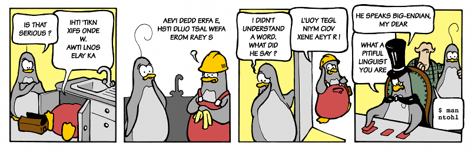

.. _az unicode reprezentaciok:

========================
A Unicode reprezentációk
========================

A legtöbb esetben a gyakorlatban nem szükséges a karakter logikai szintje alá menni, mivel a karakterek reprezentációjának problémája hosszú távra rendezve lett. Ezért is fontos megérteni az elmúlt 200 évben bekövetkezett, a tárolt karakterek számában történt drasztikus léptékváltás  mögötti vállalkozás nagyságát (Braille-írás (1821) és Morse-kód (1840) 64, ASCII (1963) 128, Latin kódtáblák (1987) 4096, Unicode 15.1 (2023) 149 813 darab).

Többé már nem fér el a reprezentáció egy bájton, így ki kellett találni, hogy hogyan lehet hatékonyan kezelni több bájtot úgy, hogy a bitek sorrendje architektúránként (big endian, little endian típusú számítógépek lásd :ref:`bitek sorrendje a szeles karakterben` rész) eltérhet. Nem a Unicode volt az első karakterkészlet, amely erre vállalkozott, de a Unicode karakterkészletben válik szét először az egyes karakterek **logikai**, **átviteli** és **tárolási reprezentációja**, melyeket eltérő problémaként kezel. Ez kiemeli a többi karakterkódolás közül, érdemes tehát tisztában lenni a döntés hátterével és a napi életre gyakorolt hatásával. A fejezet további részében ezért a különféle reprezentációk közötti konverzió alapjairól és a reprezentációk gyakorlati tulajdonságairól lesz szó.

.. _elet egy bajton tul:

---------------------------------------------------------
Élet egy bájton túl (a széles karakterek és az UTF-16/32)
---------------------------------------------------------

A számítógépes feldolgozás hagyományos egysége a **bit** (0 vagy 1-es érték), amit történelmi okokból 8-asával **bájtokba** rendezünk, és a bájtokat úgynevezett **szóvá** (két bájt, 16bit), **duplaszóvá** (4 bájt, 32bit), valamint a modern processzorokon **négyesszóvá** (8 bájt, 64 bit) tudjuk összerakni az egységek méretét duplázva. Ekkora méretekben címezhető a memória az explicit memóriakezelésű nyelvekben, mint a C/C++. A Latin kódtáblák tapasztalataiból tudjuk, hogy a Latin kódtáblacsalád 16*128 = 4096 karaktert akar kódolni (az ASCII 128 karaktere + 15-ször a felső 128 elem, lásd :ref:`iso 8859 csalad` rész). Ez 11 biten leírható, de nem használható minden karakter egyszerre. A Unicode eközben 21 bitet használ nagyságrendekkel több karakter egyidejű megcímkézésére (de a jelenleg kiosztott karakterek kényelmesen elférnek 18 biten, tehát bőven van még hely).

Összehasonlításképpen az Internet alapját képező **IPv4** szabvány 32 bites, és `kevésnek bizonyult a világ összes számítógépének megcímzéséhez <https://en.wikipedia.org/wiki/IPv4_address_exhaustion>`_, ezért bevezették az **IPv6-ot**, amely 128 bites, és lehetővé teszi, hogy minden számítógépnek akár több címe is legyen a jövőbeli növekedési ütemet figyelembe véve is. A számítógépeken az időt leíró **Unix time_t** adattípus, amely 1970. január 1. 00:00:00-tól, a 0 ponttól (**epoch**) másodpercenként egyet növekedve reprezentálja az időt, 32 bites, de csak 2038. január 19. 03:14:07-ig tartanak ki a bitek, így nemrégiben növelték a méretét 64 bitre. A modern processzorok először 8, majd 32 (1995) és manapság 64 bitesek (1999-től kezdve), manapság a grafikus processzorok 128 és 256 bitesek, de a hagyományos processzorok praktikus okokból megmaradtak 64 bitnél. Látható tehát, hogy a bitek számának problémája nem csak a karakterkódolást érinti, és nem is ez a legnagyobb ilyen jellegű probléma. A méretválasztás (és -változtatás) elsősorban a jelenlegi, másodsorban a jövőbeli rendszerekkel való kompatibilitásnak van alárendelve.

A Unicode 1.0 idejében (1991) egyes processzorok már be tudtak fogadni 32 bitet, de számolni kellett a 16 bites processzorok és a 8 és 16 bites programok tömegével, ami meghatározta, hogy hány bitben lehetett a kódoláskor gondolkodni. Bár a régi programok és processzorok eltűntek, a kódtábla mérete velünk maradt, és valószínűleg az utána jövő rendszereket is meg fogja határozni, ahogy ezt az ASCII is tette.

A Unicode 1.0 szabvány a processzorok bitjeinek szélességéhez igazodva maradt tehát a két bájtos UCS-2-nél, azaz az úgynevezett **széles karaktereknél (wide character)**, mely később önmagával kompatibilis módon át lett alakítva a (két bájt széles karaktert felhasználó ún. `surrogate pair-okkal <https://en.wikipedia.org/wiki/Universal_Character_Set_characters#Surrogates>`_) több karaktert reprezentálni tudó **UTF-16-ra**. Sajnos egyik változat sem kompatibilis az ASCII-val, és nem képes az összes jelenlegi Unicode karaktert reprezentálni. A széles karakterek rendszere egy nagyon innovatív elképzelés volt, melynek vannak előnyei és hátrányai: a (kétbájtos) fix bájtszélesség azért jó, mert így az adat ismerete nélkül is meg lehet mondani, hogy hol kezdődik, és hol ér véget az n-edik karakter a stringben (n*2 bájt és +1 a karakter vége), nem vágódhatnak „ketté” véletlenül karakterek bájtműveleteknél, viszont a bitek sorrendje architektúránként eltérhet (lásd :ref:`bitek sorrendje a szeles karakterben` rész).

Később megjelent az **UTF-32**, mely 4 bájtot foglal, és bár az ASCII-val még mindig nem kompatibilis, szemben az UTF-16-tal képes reprezentálni az összes Unicode karaktert, ámbár igen pazarló módon (elméletileg is csak 21 bitnyi információ egységesen 32 biten tárolva). A megjelenésekor még nagyon szűkösek voltak a tárolókapacitások, különösen a gépek memóriája. Ezért, valamint az akkoriban nagyon elterjedt ASCII-val való inkompatibilitása miatt nem váltotta be a hozzá fűzött reményeket. Manapság az UTF-32 a programok belső reprezentációjaként használatos, ott, ahol fontos, hogy a karakterek a fix bájtszélesség előnyével rendelkezzenek (indexelés, stringműveletek), és minden Unicode karakter reprezentálható legyen (a memóriaigény rovására).

.. _bitek sorrendje a szeles karakterben:

-----------------------------------------------------------------------------------------
A bitek sorrendje a széles karakterekben (big endian, little endian és a byte order mark)
-----------------------------------------------------------------------------------------

A különböző számítógép architektúrák között nincs egyetértés abban, hogy a memóriában **elölről hátra** (big endian) vagy **hátulról előre** (little endian) olvassák a biteket. A jelenleg használt számítógépek kevés kivétellel little endian típusúak, de ennek egyre kevesebb a jelentősége. Egy számítógépen belül nem tud összekeveredni a két reprezentáció, és az UTF-16BE és UTF-16LE (valamint az UTF-32BE és UTF-32LE) szabvány képes leírni a két állapotot egymástól függetlenül.

   „SUOY BDIA NE-GI NAID ?” A szavak karaktereit hátulról előre olvasva: YOUS AIDB IG-EN DIAN ?” azaz „YOU SAID BIG-ENDIAN ?” (forrás: `0xbabaf000l.blogspot.com <https://0xbabaf000l.blogspot.com/2009/07/suoy-bdia-ne-gi-naid.html>`_)

Az Internet elterjedésével viszont valahogy meg kellett egyeznie a gépeknek a bitek sorrendjéről az átküldendő adatot illetően. Erre az esetre vezették be az úgynevezett **byte order mark-ot (BOM)**, amely egy speciális szóközkarakternek felel meg (**„nulla hosszú nem törő szóköz”, „angolul zero width no-break space”, ZWNBSP**). Ezt küldték át a bemenet első karaktereként, jelezve a fogadó félnek, hogy bitfordításra lesz szükség a többi karakter esetében – mivel rossz sorrendben olvasva a biteket, az nem eredményez helyes karaktert. Ilyenkor a helyes bitsorrendtől függetlenül az első karakter nem az üzenet része, hanem eldobandó, mivel csak az átvitelt segíti.

A gyakorlatban néha előfordul az a hiba, hogy mégsem dobódik el, és két string a BOM-al együtt összefűződik. Ekkor a BOM vagy speciális szóközként értelmeződik, vagy nem helyes karakterként, ami `később váratlan hibát okozhat <https://unicode.org/faq/utf_bom.html>`_. **A Windows Jegyzettömbje például, amikor UTF-8 kódolással menti a fájlokat, hozzáadja a BOM karaktert, ami néhány program esetében zavart okozhat.** Erről részletesen a :ref:`utf8` részben lesz szó.

.. _utf8:

--------------------------------------------------------
UTF-8, a több bájtos, nem fix szélességű karakterkódolás
--------------------------------------------------------

Nem sokkal a Unix megalkotása után egyik találkozójukon, vacsora közben **Ken Thompson** és **Robert Pyke** rájött, hogyan lehetne karaktereket megfelelően reprezentálni úgy, hogy egy karaktert több bájton lehessen tárolni, viszont a bitsorrend ne jelentsen problémát a rendszerek közötti feldolgozásban, ráadásul kompatibilis maradjon az ASCII kódtáblával. `Az UTF-8 először így került leírásra egy alátétre (placemat) <https://www.cl.cam.ac.uk/~mgk25/ucs/utf-8-history.txt>`_.

A mára de facto alapértelmezett megoldás okosabb, mint az elődei, de azon az áron, hogy változó bájthosszúságon reprezentálja az egyes Unicode karaktereket. Ennek következménye, hogy az egyes karakterek megkülönböztetése csak a stringnek az adott karakterig történő elolvasásával tehető meg, mert máskülönben nem lehet előre meghatározni az n-edik karakter helyét.

A UTF-8 minden karaktert, amely az ASCII táblázatban benne van, egy nullával, majd az ASCII 7-bites megjelölésével reprezentál, mivel az ASCII kódtáblában a nyolcadik bit értéke nem definiált (ezt X-szel jelöljük a táblázatban):

.. table::
    :align: center

    +---+-------------------+---------------+
    |   | ASCII (1 + 7-bit) | UTF-8 (8-bit) |
    +===+===================+===============+
    | A | ``X1000001``      | ``01000001``  |
    +---+-------------------+---------------+
    | a | ``X1100001``      | ``01100001``  |
    +---+-------------------+---------------+
    | ! | ``X0100001``      | ``00100001``  |
    +---+-------------------+---------------+
    | 6 | ``X0110110``      | ``00110110``  |
    +---+-------------------+---------------+

Így az eredeti angol ábécé a lehető legkevesebb helyet foglalja egy bájtokra épülő rendszerben, és a UTF-8 kompatibilis minden régebbi, az ASCII-ra épülő kódrendszerrel (lásd :ref:`iso 8859 csalad` rész) a 7-bites ASCII karakterek értelmezésében. Ezt pedig a nyolcadik bit nullára állításával jelzi.

Ha ennél több helyre van szükség, akkor a UTF-8 a következő konvenciót követi: a **bitfolyamban** (bit stream) ha egyessel kezd egy (8-bites) bájtot (pl. ``110XXXXX``), akkor az azt jelenti, hogy kezdődik egy új karakter. Emellett az első bájt utal arra is, hogy a karakter összesen hány bájt helyet fog elfoglalni. Az első bájt elején szereplő 110 például azt jelzi, hogy a karakter összesen két bájton van kódolva, az első bájt 1110 kezdete pedig a karakter hárombájtos hosszúságára utal. A folytatásként értelmezendő bájtok, például kétbájtos karakter esetén a második, hárombájtos karakter esetén pedig a második és a harmadik bájt mindig 01-gyel kezdődik: ez jelzi, hogy folytatásról van szó, nem pedig egy új karaktert kódoló bájtsorozat kezdetéről. (Illusztráció: `Characters, Symbols and the Unicode Miracle - Computerphile <https://www.youtube.com/watch?v=MijmeoH9LT4&t=422s>`_):

.. table::
    :align: center

    +-----------------------------+------------------+------------------+------------------+
    |                             | Első bájt        | Második bájt     | Harmadik bájt    |
    +=============================+==================+==================+==================+
    | Ha egybájtos a karakter     | 0 _ _ _ _ _ _ _  |                  |                  |
    +-----------------------------+------------------+------------------+------------------+
    | Ha kétbájtos a karakter     | 1 1 0 _ _ _ _ _  | 0 1 _ _ _ _ _ _  |                  |
    +-----------------------------+------------------+------------------+------------------+
    | Ha hárombájtos a karakter   | 1 1 1 0 _ _ _ _  | 0 1 _ _ _ _ _ _  | 0 1 _ _ _ _ _ _  |
    +-----------------------------+------------------+------------------+------------------+
    | .. centered:: …                                                                      |
    +-----------------------------+------------------+------------------+------------------+

Így minden bájtnál marad olyan bit, amit még nem használtunk fel semmire. Az első  bájtnál ez változó, ha például kétbájtos a karakter, azaz 110-val kezdődik az első bájt, akkor ott 5 üres bit marad, de a többi bájtnál fix 6 üres bit áll rendelkezésre. Így két bájton 2\ :sup:`5+6` = 2 048-ig lehet elszámolni, három bájton 2\ :sup:`4+6+6` = 65 536-ig, és így tovább.

Mivel a karaktereket a használathoz mindenképp át kell kódolni, az UTF-8 a big endian és little endian rendszerekkel is kompatibilis (lásd :ref:`bitek sorrendje a szeles karakterben` rész). A fájlrendszereken tárolt adatok esetén ez a tulajdonság azért jön kapóra, mert ha kivesszük a háttértárat, és áttesszük egy másik architektúrájú számítógépbe, akkor a számítógép a bitsorrendtől függetlenül képes értelmezni a karaktereket. Ez hasonlóan igaz a hálózaton átküldött szöveges adatokra is, aminek az UTF-8 az igazi népszerűségét köszönheti.

Kompatibilitási okokból definiálható UTF-8-ban is a BOM. A `Windows 10 2019-es kiadása előtti verzióknál <https://stackoverflow.com/questions/8432584/how-can-i-make-notepad-to-save-text-in-utf-8-without-the-bom/57210570#57210570>`_ a Jegyzettömb (Notepad) UTF-8 kódolással való mentéskor a program mindenképp belerakja a fájlba a BOM-ot, ami az egyéb programokat megzavarja, mivel UTF-8 esetén nem számítanak BOM-ra. Emiatt a Notepad használata nem ajánlott, helyette például a Notepad++ használata javasolható. A különféle programnyelvekben a beolvasáskor beállítható, hogy számítsanak UTF-8 esetén a BOM-ra, de kész programoknál ez többnyire nem lehetséges.

.. _ melyik reprezentacio mire jo:

-----------------------------
Melyik reprezentáció mire jó?
-----------------------------

Az UTF-16 kompromisszumos megoldásként a mai napig fontos szerepet tölt be, mivel a rendszer **korai használói (early adopter)**, mint például a **Java** és **JavaScript** programozási nyelvek, valamint a **Windows API-ja** (a **Windows NT 3.1** első 32 bites kiadása 1993-ban) ezt implementálták, és kompatibilitási okokból azóta sem tudták meglépni a váltást. A **Windows XP** (2001) óta **65001-es kódlap** néven elérhető az UTF-8 kódolás, de nem rendszerszinten. 2018 áprilisa óta a Windows 10 és az azóta megjelent Windows 11 béta állapotban szállítja a rendszerszintű UTF-8 kódolást, amelynek használata a Windows 10-ben sok hibát okoz, ezért nem ajánlott. A régóta létező **Unix** és az új **Linux** rendszerek először maradtak a „8-bit tiszta” működésnél (lásd :ref:`karakterhivatkozasok` rész) és az ASCII/Latin kódolásoknál, később pedig átálltak az utóbb megjelent, kompatibilis UTF-8-ra, fenntartva a folyamatos kompatibilitást. Az interpretált programnyelvek (mint a **Python**) belső használatra UTF-32-t használnak, de a külső programokkal (pl. hálózat, háttértár) alapértelmezésben UTF-8-ban, illetve a beállított kódolásban kommunikálnak. Az internetes szöveges protokollok pedig szinte kivétel nélkül átálltak az UTF-8 kódolásra, hiszen kompatibilis az addig használt ASCII-val, helytakarékos, és nem szükséges a karakterek értelmezése (lásd :ref:`karakterhivatkozasok` rész), amelyhez kellene az indexelés.

Látható tehát, hogy mindegyik reprezentációnak megvan az ideális felhasználási módja. A hálózati átvitelhez és a lemezen való tároláshoz, ahol a karakterek adatként reprezentálódnak, a helytakarékos UTF-8 használatos. Ezzel szemben a programokon belül, ahol potenciálisan nyelvfüggő műveleteket kell végezni az egyes karaktereken, amihez szükséges az indexelés, az UTF-16 vagy szükség esetén az UTF-32 reprezentáció jellemző. Ezzel a Unicode minden modern használati esetet le tud fedni, és teljesíti a tervezett funkcióját.

.. _betuszemet:

-------------------------------------------------------------------
A karakterreprezentáció-konverziós hibák és a betűszemét (mojibake)
-------------------------------------------------------------------

A sok reprezentáció közötti átalakítás nem mindig zökkenőmentes, de a régi szövegek konverziójakor is előfordulhatnak hibák. Ilyenkor nagyon fontos tudnunk, hogy mire számíthatunk, és mit szeretnénk elérni, hogy elkerüljük a duplán kódolt karakterhivatkozásokat vagy az adatvesztést amiatt, mert egy kevesebb karaktert reprezentálni tudó rendszerbe illesztjük a bemenetünket (pl. ASCII kompatibilis *JSON-t* készítünk, amely az alapbeállítás Pythonban, lásd :ref:`kodtablafuggetlen karakterhivatkozasok` rész). Amikor a konverzió nem sikerül, akkor az így keletkezett zavaros karakterhalmazt hívjuk **betűszemétnek**, angolul „mojibake”-nek. A karakterek bájtokká alakítására és a bájtok karakterekre alakítására a következő beállítások állnak rendelkezésre (lásd :ref:`python bajtok es karakterek` rész):

- **strict**: Az első nem helyesen kódolt karakter beolvasásánál vagy a kimeneti kódlapon nem kódolható karakter írásánál hibát ad.
- **ignore**: (A fenti) hibák esetén a kérdéses karaktert kihagyva folytatja a (de)kódolást. (Mindenképp lefut, de adatvesztés keletkezhet.)
- **replace**: (A fenti) hibák esetén a kérdéses karaktert kicseréli „replacement karakterre” (``�``), amely kizárólag a hibásan kódolt karakterek jelzésére fenntartott „extremális” karakter. (Mindenképp lefut, de adatvesztés keletkezhet.)
- **backslashreplace** (csak Python): A nem dekódolható bájtokat átalakítja ``\xNN`` formára, a nem kódolható karaktereket ``\uNNNN`` alakúra.
- **xmlcharrefreplace** és **namereplace** (csak Python, csak kódolásnál): A nem kódolható karaktereket átalakítja XML karakterhivatkozás vagy név szerinti Unicode hivatkozás formátumra.
- **transliterate** (csak ``iconv``, csak kódolásnál): A nem kódolható karaktert kicseréli egy hasonló glifájú karakterre, pl. ``é`` -> ``e``. (Mindenképp lefut, de adatvesztés keletkezhet.)
- **escape**: A nem kódolható karaktereket **XML** (&...;)/**hexadecimális** (\x1234)/**Unicode** (\uXXXX)/\N{...} alakú hivatkozássá alakítja, illetve ezeket visszaalakítja.

A HTML és XML fájlokban szövegesen meg lehet jelölni a dokumentum kódolását, amely kiolvasható ASCII betűkkel, mivel a fájl elején direkt csak ilyen karakterek szerepelnek. Ekkor a feldolgozó program átváltja a kódolást továbbhaladás előtt, vagy újra megnyitja a fájlt helyes kódolással, feltételezve, hogy az adat megfelel a jelzett formátumnak. Furcsa hibákat tud eredményezni, ha a jelzett kódolás és a valódi kódolás eltér, mégis gyakorlatban előfordul ilyen eset is. A hibás konverzió megtörténhet például a különböző Latin kódolások keverésével, vagy pedig egy UTF-8 bájtsorozat Latin kódolásúként való megnyitásával. Ilyenkor mindegyik változat beolvasható, „helyes” (valid) kódolást eredményez, de máshogy konvertálódik és jelenik meg:

.. table::
    :align: center

    +-----------------------+---------------------------+--------------------------------------+----------------------------+
    | .. centered:: Valódi  | .. centered:: Kódolás,    | .. centered:: Eredmény               |  .. centered:: Megjegyzés  |
    | .. centered:: kódolás | .. centered:: amiben      |                                      |                            |
    |                       | .. centered:: megnyitjuk  |                                      |                            |
    |                       | .. centered:: (deklarált) |                                      |                            |
    +=======================+===========================+======================================+============================+
    | Latin-1               | Latin-2                   | árvíztűrőtükörfúrógép                | magyar ű és ő betűk        |
    +-----------------------+---------------------------+--------------------------------------+----------------------------+
    | Latin-2               | Latin-1                   | árvíztûrõtükörfúrógép                | kalapos ű és hullámos ő    |
    +-----------------------+---------------------------+--------------------------------------+----------------------------+
    | | Latin-1             | UTF-8                     | | �rv�zt�r�t�k�rf�r�g�p              | | a dekódolástól függően   |
    | | /Latin-2            |                           | | rvztrtkrfrgp                       | | (replace vs. ignore)     |
    +-----------------------+---------------------------+--------------------------------------+----------------------------+
    | UTF-8                 | Latin-1                   | árvÃ\xadztűrÅ\x91tükörfúrógép | mojibake                   |
    +-----------------------+---------------------------+--------------------------------------+----------------------------+
    | UTF-8                 | Latin-2                   | ĂĄrvĂ\xadztĹąrĹ\x91tĂźkĂśrfĂşrĂłgĂŠp | | mojibake                 |
    |                       |                           |                                      | | (más mint a Latin-1-nél) |
    +-----------------------+---------------------------+--------------------------------------+----------------------------+

A szövegfájlokat karakterhivatkozásokkal tarkítva (pl. JSON) még összetettebb hibákat lehet kapni (lásd :ref:`kodolasi hibak, furcsasagok` rész). Ráadásul az eredményt UTF-8 formátumban mentve észrevétlenül tovább lehet súlyosbítani a helyzetet, hiszen kódolás szempontjából helyes UTF-8 lesz a mojibake adatunk. Szerencsére a fájl utólag is javítható, ha a hibás konverziót visszafelé elvégezzük, és a helyes kódolásban nyitjuk meg a fájlt.

Az ilyen, a kódolás szempontjából helyes, de a felhasználó céljával nem egyező kimeneti esetek számosságából következik, hogy a valódi karakterkódolást 100%-osan nem lehet meghatározni automatikus módszerekkel, de karakterstatisztikák és bitminták segítségével jó hatékonysággal meg lehet tippelni. A ``chardet`` könyvtár a de facto sztenderd megoldás a karakterkódolás automatikus felismerésére, és a legtöbb esetben működik is. Ugyanakkor `a Latin-2 kódtáblával kódolt magyar nyelv felismerése már évek óta ki van kapcsolva benne <https://github.com/chardet/chardet/commit/da6c0a079c41683ca475e28364fcf9c4d34f4359>`_, ezért általában török kódtáblának ismeri fel az ilyen szövegeket.
Linux alatt elérhetőek az ``iconv`` és az ``icu`` programok, melyek a fájlok konverzióját egyszerűen el tudják végezni, így megfelelő paraméterek megtalálása esetén a javítás már triviális. Érdekesség, hogy `az iconv program megengedő, BSDL licencű implementációját Kövesdán Gábor BME mérnök informatikus hallgató írta meg BSc szakdolgozata részeként. <https://hup.hu/cikkek/20100617/bsdl-es_iconv_a_freebsd_alaprendszerhez>`_

Előfordulhat, hogy a különböző fájlrendszerekből származó fájlok és mappák nevében található ékezetek szenvednek konverziós hibától. A főbb mai fájlrendszerek alatt használható fájlnévkonvenciók szerint a fájlok neve maximum 127 darab bármilyen UTF-16 (Unicode BMP) kódolás karakter lehet, mely osztályból kivételt képeznek a speciális jelentéssel bíró karakterek és karaktersorozatok például a ``.``, ``..`` és a mappa elválasztó ``/``, más néven fordított törtvonal. A rosszul kódolt fájlnevek tömeges átnevezését segítő program, a ``convmv``, az ``iconv`` programhoz hasonlóan csak a bemeneti és kimeneti karakterkódolás megadását igényli. ZIP fájlok esetében előfordul, hogy ha az archivált fájlnevek ékezetet tartalmaznak és nem UTF-8 kódolással vannak kódolva, a fájlok és mappák neveiben az ékezetek elromlanak. Például a Windows tömörített mappa funkciójával tömörített fájlok Linux alatti kibontásánál. Ilyenkor meg kell adni a megfelelő kódtáblát a helyes fájlnevek előállításához (lásd :ref:`ekezetes zip kitomorites` rész).
