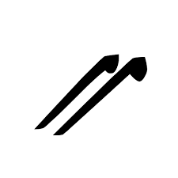

.. _a unicode szemlelete:

====================
A Unicode szemlélete
====================

Az elvárások egy univerzális karakterkódolással szemben igen magasak:

- A világ összes – nem csak latin és nem csak balról jobbra író – nyelvének minden betűjét, számát és írásjelét egyértelműen, tipográfiailag helyesen kell tudni benne jelölni, akár egyszerre, és korlátozott beviteli eszközök esetén is. Emellett nyitottnak kell lennie a további bővítésre.
- Az ASCII szabvánnyal való kompatibilitás (legalább a tartalmazott karakterek tekintetében, optimálisan reprezentációban is).
- A kis és nagybetűk közötti konverzió (ami nyelvfüggő).
- A karaktersorozatok nyelvfüggő ábécésorrendbe rendezése, és a több karakteres betűk (dzs, sz stb.) helyes kezelése.
- Több bájton való tárolás esetén (ami elkerülhetetlen) a bitek és bájtok sorrendjének egyértelmű definiálása a különböző architektúrákon való működés végett.
- A több bájton való tárolás problémájának megoldása: a **fix bájtszélességű** karakterek (**wide character**) pazarlók, viszont a **változó szélességű** karakterek (**multibyte**) nem indexelhetőek jól (szétvágódhatnak a több bájtos karakterek).

Ezekre a problémákra több szervezet is éveken keresztül próbált megoldást találni. Egyfelől az ISO, melynek munkatársai az **ISO 10646**, más néven **Universal Coded Character Set (UCS)** szabványon dolgoztak. Másfelől a 80-as évek legnagyobb szoftvercégei megalakították a **Unicode Consortiumot**, mely a **Unicode** karakterkészlettel (Illusztráció: `The Unicode Consortium Overview <https://www.youtube.com/watch?v=-n2nlPHEMG8>`_) megpróbálta betölteni azt a piaci rést, mely a karakterkódolás egységesítése terén nyílt. Az ISO 10646 által definiált Universal Coded Character Set (UCS) tehát egy nemzetközi szabvány, a Unicode Consortium karakterkészlete, a Unicode pedig egy ipar által fejlesztett egyezményes kódtábla. Ezek manapság szinonimaként használhatók, abból kifolyólag, hogy az 1990-es évek elején a két szervezet megállapodott, hogy együtt dolgoznak tovább, és igaz, a mai napig külön publikálnak új változatokat, `a két karakterkódolás a betűk reprezentációjának szintjén megegyezik <https://en.wikipedia.org/wiki/Universal_Coded_Character_Set#Differences_from_Unicode>`_. 2023 végére a 15. verziónál tart a szabvány, ami mutatja, hogy szükség esetén jól bővíthető.

A modern szövegeknél gyakorlatilag csak Unicode (UTF-8) szövegekkel lehet találkozni, és mára szinte az összes rendszer teljesen támogatja. Nincs szükség az ékezetlen és egyéb egyszerűsített formák használatára, viszont még egy évtizeddel ezelőtt is nagy számban voltak olyan rendszerek és szövegek, amelyek Latin vagy más régi kódolást használtak, és modernizálás nélkül kerültek archiválásra. Sokszor pedig a korlátozott beviteli lehetőségek (pl. billentyűzetkiosztás) miatt vagy megszokásból egyszerűbb a felhasználóknak ékezet nélkül vagy helytelen tipográfiával bevinni a karaktereket. Így elkerülhetetlen, hogy ilyen szövegekkel is találkozzon az ember.

.. _a unicode felepitese:

---------------------
A Unicode felépítése
---------------------

Minden karakter kap egy számot (un. **kódpontot**). Az :ref:`ASCII kódtábla <ascii>` összes karakteréhez tartozó kódpont át lett véve (mint a legtöbb karakterkódolási standard esetében), így a benne foglalt karakterek szintjén – és az UTF-8 kódolási forma esetében a reprezentáció szintjén is (lásd :ref:`utf8` rész) – visszafelé kompatibilis az ASCII kódtáblát használó régebbi rendszerekkel. A többi karakterkódoláshoz képest a Unicode-ban a reprezentáció teljesen külön lett választva a karakter definíciójától, mivel egy karakter akár többféleképpen is reprezentálható (multibyte vs. wide character reprezentációk).

Ahogy az ASCII kódtábla esetében, a karakterek itt is tudatosan vannak elhelyezve: a kódtábla 16 bites, úgynevezett **síkokra** van osztva. Összesen 17 sík van, darabonként 65 536, azaz összesen 1 114 112 kódpont. Az első sík az **alapszintű többnyelvű sík (BMP – Basic Multilingual Plane)**, ez tartalmazza majdnem az összes ma használatos karaktert, és lehetővé teszi a szinte határtalan bővíthetőséget. A síkokon belül nevekkel ellátott, különböző méretű **blokkok** találhatók. A „sima” karakterek mellett vannak speciális, például kombinálódó karakterek is (lásd :ref:`nyomtatas es olombetuk` valamint :ref:`megjelenites es komb` részek), amelyekkel szinte a végtelenségig bővíthető a kódtábla kifejező ereje.

   `Ian Albert <https://ian-albert.com/unicode_chart/>`_ így vizualizálta az egész Unicode táblázatot (forrás: https://xivilization.net/~marek/tex/unicode/unichart-printed.jpg).

A kódpontok jelölése **U+XXXX**, amelyekben az XXXX legalább 4 darab **hexadecimális számjegy**. Az egyes betűkészletek eldönthetik, hogy rendelnek-e glifát az adott kódponthoz, így nem minden karakternek van minden betűkészletben megfelelője, és a megjelenésük betűkészletenként eltérhet (lásd :ref:`betutipusok` valamint :ref:`megjelenites es komb` részek).

Az alábbiakban a Unicode kódtábla karaktereiből mutatunk be néhány példát.

   A szkíta „kha” karakter kapta például a 43 155 kódpontot (U+A893).

   A bizánci zenei jelek közül az „Oxeia Dipli” kapta a 118 788 kódpontot (U+1D004).

   A *225 fokban elforgatott fekete huszár (sakk)* pedig a 129 585 kódpontot (U+1FA31).

2010-től megjelentek az emojik is a Unicode tárházában (lásd :ref:`megjelenites es komb` rész):

.. table::
    :align: center

    +-----------------------------------+------------------------+-----------------------+-----------------------+
    | .. centered:: Karakter            | .. centered:: 🙂       | .. centered:: 😎      | .. centered:: 🦔      |
    +-----------------------------------+------------------------+-----------------------+-----------------------+
    | .. centered:: Kódpont (decimális) | .. centered:: 128 578  | .. centered:: 128 526 | .. centered:: 129 428 |
    +-----------------------------------+------------------------+-----------------------+-----------------------+
    | .. centered:: Kódpont             | .. centered:: U+1F642  | .. centered:: U+1F60E | .. centered:: U+1F994 |
    +-----------------------------------+------------------------+-----------------------+-----------------------+

.. _tulajdonsagok:

-------------
Tulajdonságok
-------------

Az ekkora mennyiségű karakter hatékony kezeléséhez további kapcsolatokat kell definiálni köztük. Ezért minden egyes karakter rendelkezik **tulajdonságokkal**, amelyek leírják a működését a különféle nyelvek esetében. Például *szám*, *kis- vagy nagybetű*, *központozási karakter*, *balról jobbra írás*. A tulajdonságok lehetnek binárisak (*igaz*, *hamis*), vagy lehet értékük (pl. név, nyelv). Ezen felül minden karakternek van egy egyedi neve, amit hivatkozásként lehet használni a karakter leírásához (pl. a *\\N{LATIN SMALL LETTER O WITH DOUBLE ACUTE}* hivatkozást beírva egy ``ő`` karaktert kapunk).

A tulajdonságok alapján is meg lehet határozni karaktercsoportokat. Például a **szóköz kategória** egymaga 17 féle tipográfiailag szükséges különböző szóköz karaktert tartalmaz. `Ezzel az oldallal meg lehet vizsgálni az ilyen és hasonló, szövegben rejtőző láthatatlan karaktereket <https://www.soscisurvey.de/tools/view-chars.php>`_ (lásd :ref:`karakterhivatkozasok` rész). Ugyanakkor nem szükséges ismernünk az összes elemét egy-egy tulajdonságnak, mert a kategória nevével lehet hivatkozni az osztályt az elemeinek felsorolása helyett, többek között a reguláris kifejezések esetében, jelentősen könnyítve ezzel a munkát (lásd :ref:`unicode karakterhivatkozasok` rész).

.. _normalizacio es spam szures:

---------------------------
Normalizáció és SPAM szűrés
---------------------------

Problémát jelenthet, hogy a szövegek kezelésekor a láthatatlan karakterek miatt nem lesz pontos egyezés a stringegyenlőség-vizsgálatnál két ugyanúgy kinéző string között, habár szemre megkülönböztethetetlenek. Emellett megjelentek olyan támadások is, ahol a glifa szemre nagyon hasonlít egy ismert karakterre, vagy szemmel megkülönböztethetetlen tőle, de mivel másik karakter, a gép által máshogy van kezelve, például egy másik, **csali doménre** visz, ahol a titkos adatainkat akarják kicsalni (pl. `gov.hu vs. qov.hu (Kovács László: A kibertér védelme (2018) 163. oldal) <https://www.uni-nke.hu/document/uni-nke-hu/Kov%C3%A1cs%20L%C3%A1szl%C3%B3.pdf>`_). A hagyományos szóalapú spamszűrők nem fogják meg az ilyen karakterekkel leírt szavakat, csak az ember számára érthetőket szűrik ki. Például az alábbi string egy valódi spam email tárgya (láthatóak a furcsa betűk, amelyek nem sima latin betűk, és a spamszűrőt próbálják megzavarni az olvashatóság megtartása mellett):

.. code-block:: text

    Invіtаtіоn to Տυbmіt Ρaρҽrs and Јοіn the ΕԀitоrial ᗷоarԀ/Reνіeԝer Team

`Ezzel az oldallal meg lehet nézni karakterenként a gyanús stringeket <https://apps.timwhitlock.info/unicode/inspect>`_, a fenti példát is, amelyben hemzsegnek a különféle nemzetek betűi (cirill, görög, latin, örmény stb.). Manapság ezek a fajta támadások csak nagyon célzottan jellemzőek (pl. qov.hu vs. gov.hu), mivel a speciális karakterek Unicode karakterosztályok segítségével könnyen szűrhetőek, jelenlétükkel csak gyanúsabbá téve az üzenetet.

A másik megoldás a Unicode normalizáció, aminek különféle formái vannak, hogy a szövegben szereplő karakterek egységes, hasonlóan kinéző és viselkedő formára alakíthatóak legyenek, könnyítve ezzel az egyenlőségvizsgálatot. A normalizáció az úgynevezett kanonikusan egyenlő karaktereket egységes formára hozza (pl. mindegyik/egyik sem kombinálódó ékezettel írva). Használatára csak nem megbízható forrású adat esetén van szükség. A Unicode-normalizálás `egyszerűen kipróbálható ezzel az oldallal <https://onlineunicodetools.com/normalize-unicode-text>`_. A fenti példa latin karakterekre normalizálva:

.. code-block:: text

    Invitation to Svbmit Papers and Join the Editorial Board/Reviewer Team

.. _megjelenites es komb:

-------------------------------------------------------------------------------
A megjelenítés és a kombinálhatóság modern felhasználása (emotikonok és emojik)
-------------------------------------------------------------------------------

A karakterek hagyományosan fehér alapon feketék és érzelemmentesek. Bár léteznek művészi ábrázolások (lásd :ref:`ascii rajzok` rész) nem céljuk a szövegbe történő beágyazhatóság. A szöveg értelmezését segítő érzelmek kifejezésére nyugaton a hagyományos, ASCII-val leírható, zárójelalapú nyugati **emotikonok** ( ``:-)`` és ``:)`` ) terjedtek el, melyek a száj formájával fejezik ki az érzelmeket. Ezzel szemben Japánban a sokkal összetettebb, nem ASCII karaktereket is tartalmazó **kaomojik** (``(◕‿◕)`` és ``(￢‿￢ )``) divatosak, melyek a *manga* hagyományaiból táplálkoznak, és elsősorban a szemek formáját variálják. Ezenkívül elérhetőek a **Miscellaneous Symbols (Unicode 1.1, 1993)** blokkban létrehozott jelek (``☏`` és ``☃``).

A további igények felbukkanásával egyes Japán telekommunikációs cégeknél megjelentek további, nem szabványos érzelemjelölési módszerek a még nem foglalt kódpontokon, hogy ezzel nyerjenek helyet a maximum 160 karakter hosszú SMS-ekben. Ezt a jelenséget szabványosítandó, 2008-ban beterjesztették, és a Unicode 6.0-val (2010) beépítették a Unicode kódtáblába az **emojikat** mint önálló karaktereket, melyek az emotikonokkal ellentétben nem ASCII karakterekből állnak, hanem saját glifákkal rendelkeznek.

A Unicode 8.0-ig (2015) kellett csak várni, hogy megjelenjenek az első módosítók az emojikhoz, hogy az emberek a bőrszínüknek megfelelő változatot tudják használni és beállítani alapértelmezettnek. Ezt az írógépektől örökölt kombinálódó karakterekkel (lásd :ref:`bevitel gyorsitasa` valamint :ref:`repulo ekezetek es proszeky-kod` részek) lehet megoldani anélkül, hogy túlságosan nagy mennyiségű karaktert kelljen lefoglalni az összes változatnak, és kifogyjunk a reprezentálható karakterekből. A rendszer azóta is tovább bonyolódik, és megjelentek a hagyományos emotikonokat háttérbe szorító karakterhivatkozások (``:smile:`` és ``:+1:``), az ASCII karakterekből kaomojit gyártó megoldások (`ASCIImojik <https://asciimoji.com/>`_), valamint a kombinálódó karakterhivatkozások, melyek egymásra rakásával nemcsak a karakter bőrszíne, hanem a neme is meghatározható (pl. `terhes férfi emoji <https://emojipedia.org/pregnant-man/>`_ (🫃), háttér: `Why Is There a Pregnant Man Emoji? <https://blog.emojipedia.org/why-is-there-a-pregnant-man-emoji/>`_).

Az, hogy pontosan hogyan nézzen ki az emoji, nincs meghatározva a Unicode rendszerében (lásd :ref:`glifak` rész). Ezért van az, hogy az *iPhone* és az *Android* készülékeken vagy a különböző böngészőkben nem pont ugyanolyan a mosolygós fej. `A karakterek, például a sündisznó jel (🦔) különböző glifáit ezen az oldalon lehet megnézni <https://unicode-table.com/en/1F994/>`_.

Manapság gyakori jelenség, hogy az emberek az egyszerűség kedvéért **képírásban** kommunikálnak **emoji szekvenciákkal**, szöveg nélkül – teret hagyva az üzenet szabadabb értelmezésének, ami nem mindig sül el jól (Illusztráció: `Former Bed Bath & Beyond investor Ryan Cohen must face emoji-inspired shareholder suit <https://www.nbcnews.com/business/business-news/ryan-cohen-bed-bath-beyond-investor-emoji-lawsuit-rcna97379>`_ és `Canadian farmer's thumbs-up emoji leads to $62,000 fine for undelivered flax <https://www.reuters.com/world/americas/canadian-farmers-thumbs-up-emoji-leads-62000-fine-undelivered-flax-2023-07-07/>`_). A mondanivaló ilyenfajta kifejezését nehezíti, hogy a Unicode pozitív szemléletet követ az emojik terén, tehát gyakorlatilag nincsenek negatív, obszcén, szexualizált vagy korhatáros emojik. Ez a döntés viszont kisiklott, mivel ahogy a szavaknál, megjelent az emojiknak is egy másodlagos, szleng értelme, mely sokszor lehet például szexualizált (🍑, 🍆 és 💦). Szerencsére az értelmezésükhöz már van `emoji magyarázó szótár <https://hotemoji.com/eggplant-emoji.html>`_, ami tartalmazza a szleng értelmezést is! Az ilyen „rejtjelezés” célja az automatikus moderáció elkerülése és a tabutémák, többek között az „álhírek” vagy „gyűlöletbeszéd” titokban történő terjesztése: például vakcina tagadó csoportok esetén répa (🥕) emoji használata az „oltás” kifejezés helyett. (Illusztráció: `Anti-vax groups use carrot emojis to hide Facebook posts <https://www.bbc.com/news/technology-62877597>`_). Ezek a megoldások nyelvi jellegükből adódóan a későbbiekben komoly tudományos kutatás témájává is válhatnak (v.ö. `Pompeii falfirkák <http://ancientgraffiti.org/Graffiti/>`_). Egy másik tanulságos eset, hogy emojikból is megárt a sok, amikor `a Whatsapp okostelefonos applikációját táolról össze lehetett omlasztani pusztán 4000 emoji egy üzenetben való elküldésével. <https://web.archive.org/web/20160517012410/http://www.hacker9.com/single-message-can-crash-whatsapp.html>`_ Látható tehát, hogy az emberi kreativitás határtalan, de `a Unicode még mindig tartja magát <https://en.wikibooks.org/wiki/Unicode/Versions>`_.

.. _lokalizacio:

-----------
Lokalizáció
-----------

A különböző reprezentálható nyelveknek saját inherens tulajdonságaik vannak (pl. **ábécé sorrend**, **tizedes és ezres elválasztó karakterek**, **idézőjelek**, **pénznem**, **dátum**). Ezek nyelvhelyes megjelenítésére és a nyelvek közötti könnyű változtatás céljából jött létre a **lokalizáció** a Latin kódtáblák megjelenésekor, mely a Unicode karakterkészlet létrehozása után hatalmas fejlődésen ment keresztül, hogy minden szóba jöhető nyelvi sajátosságot ki tudjon szolgálni megfelelő sebességgel. A mindennapi gyakorlatban a lokalizáció nyelve megadható az egész rendszer számára és felülbírálható egy program vagy programstruktúra (shell) számára.

Az egyes **területi beállítások (locale)** adatai általában nem érhetőek el minden nyelvre az alaptelepítés részeként, ezért ezt szükséges ellenőrizni és a hiányzókat telepíteni. A Linux parancssorban a ``locale`` parancs megmutatja az aktuális beállításokat, és a ``locale -a`` parancs pedig az elérhető lokalizációkat. A Latin-2-es magyar beállítás kódja ``hu_HU``, a Unicode-é ``hu_HU.UTF-8``, míg az angol beállításhoz alapesetben az USA által használt ``en_US`` és ``en_US.UTF-8`` változatok vannak telepítve alapértelmezésben, de még használatos a számtalan változat közül a brit ``en_GB`` és ``en_GB.UTF-8`` változat is. 

Fontos kiemelni a **C** vagy más néven **POSIX locale**-t (``C`` és ``C.UTF-8``), mely a C programozási nyelvből származó beállítás, amely a lehető legkevesebb szabályt alkalmazza a stabil kimenet (pl. ábécébe rendezés) eléréséhez. A nem-interaktív rendszerek (pl. Python) alapbeállításban ezt használják a vele elérhető sebesség miatt.

A legszembetűnőbb formája a területi beállításoknak az **ábécébe rendezés (kolláció)**, mivel a magyar nyelvben ékezetes betűk és két vagy három karakteres betűk is vannak, amelyek angol nyelvű beállítás esetén magyar szemmel furán rendeződnek sorrendbe, hiszen az ékezetes betűk hátra kerülnek az angol ábécé utolsó betűje után. `Ennek elérése sok különleges szabály alkalmazását igényli <https://hup.hu/cikkek/20180330/jojj_el_szabadsag_te_szulj_nekem_rendet>`_, ami nagyon le tudja lassítani a futtatást. Ezért, ha csak a reprodukálható sorrend a fontos (pl. azonos elemek csoportosításánál), akkor használjuk a ``C.UTF-8`` lokalizációt, és csak „emberi felhasználásra” a magyar kollációt. Így nagy sebességnövekedés érhető el bizonyos feladatok esetében.

.. _kis es nagybetusites:

-----------------------------------
A kis- és nagybetűsítés furcsaságai
-----------------------------------

`A lokalizáció a lehetőségek mellett problémákat is szült <https://richardjharris.github.io/all-sorts-of-things-you-can-get-wrong-in-unicode-and-why/>`_. A különféle nyelveken a **kis- és nagybetűsítés** egyszerű folyamat, de a Unicode-ban ezek a nyelvek egyszerre, egy dokumentumon belül is jelen lehetnek, így a kis- és nagybetűsítési szabályok könnyen összekeveredhetnek. Például a német **„Eszett” betű, németül „scharfes S” karakter** (``ß``) a kisbetűsítés során ``ss``-szé, azaz dupla ``s``-sé változik, tehát a kisbetűsítés bemenetén jelenlevő egy karakterből kisbetűsítés után két karakter lesz, viszont a fordított irányban már ``SS``-t kapunk, mivel az ``s`` karakterek külön-külön nagybetűsítődnek.

Egy másik szemléletes példa, hogy míg a magyar és az összes latin nyelv beállítása szerint a *pontos kis „i”* (``i``) nagybetűs változata ``I`` *(pont nélküli nagy „i”)*, addig a török nyelvben van egy *pontos „i”* (``i``) és egy *pont nélküli „i”* (``ı``), és mindkettőnek van nagy- és kisbetűs változata, összesen négy karaktert eredményezve: a *kis pontos „i”-nek* (``i``) a *nagy pontos „i”* (``İ``), a *kis pont nélküli „i”-nek* (``ı``) pedig a *nagy pont nélküli „i”* (``I``) a párja. Mivel a kis- és nagybetűsítés a lokalizációs beállításoktól függ, török nyelvű beállítások mellett nem fog megjelenni vagy eltűnni a pont az „i”-ről, míg bármelyik latin nyelvű beállítást használva a pont megjelenik, illetve eltűnik, a török nyelv szempontjából új betűt eredményezve, és ugyanez igaz a török nyelvű mindkétféle „i” betű latin nyelvi beállításokkal történő kis- és nagybetűsítése esetén. Az ilyen egybeesések miatt kell a megfelelő lokalizációs beállítások mellett kis- és nagybetűsíteni, hogy elkerüljük a nem várt változásokat.

.. table::
    :align: center

    +--------+--------------------------+------------------------------+-------------------------------+
    | Nyelv  | Betű                     | Kisbetű megfelelő            | Nagybetű megfelelő            |
    +========+==========================+==============================+===============================+
    | magyar | pontos „i” (``i``)       | pontos kis „i” (``i``)       | pont nélküli nagy „i” (``I``) |
    +--------+--------------------------+------------------------------+-------------------------------+
    | török  | pontos „i” (``i``)       | pontos kis „i” (``i``)       | pontos nagy „i” (``İ``)       |
    +--------+--------------------------+------------------------------+-------------------------------+
    | török  | pont nélküli „i” (``ı``) | pont nélküli kis „i” (``ı``) | pont nélküli nagy „i” (``I``) |
    +--------+--------------------------+------------------------------+-------------------------------+

`Ezt a helyzetet egy ügyes hacker kihasználta <https://web.archive.org/web/20211106053748/https://eng.getwisdom.io/hacking-github-with-unicode-dotless-i/>`_, és feltörte a *Github-ot* az elfelejtett jelszó funkcióján keresztül egy Unicode-ban megengedett török pont nélküli nagy „i” (``I``) használatával. A rendszer a bemenetként kapott Unicode-ban lévő e-mail címet összehasonlítás előtt a normalizáció részeként latin lokalizációnak megfelelően pontos kis i betűre kisbetűsítette, összehasonlította a tárolt adattal, és egyezés után az eredeti bemenetet használta a későbbiekben – hiszen „ugyanaz a kettő”, a támadó e-mail címére küldve az új jelszó megadását lehetővé tevő linket. A hibát azóta javították, de a tanulság az, hogy érdemes odafigyelni a nyelvi beállításokra, és nem interaktív körülmények között a C.UTF-8 locale-t használni (lásd :ref:`lokalizacio` rész).
